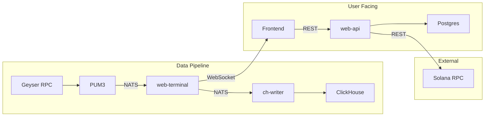

# CrossMap Workflow

Map relationships and data flows between systems.

## Inputs

- **systems**: List of systems to map (optional, defaults to all registered)
- **focus**: `dependencies` | `data-flows` | `interfaces` | `all` (default: `all`)

## Process

### Step 1: Load System Documentation

```
For each system in scope:
1. Read ai.md (Cross-System Context section)
2. Read any existing interface documentation
3. Load from knowledge registry context
```

### Step 2: Extract Relationships

```
For each system, identify:

1. Dependencies (what it needs):
   - External services consumed
   - APIs called
   - Data sources read from
   - Message queues subscribed to

2. Provisions (what it provides):
   - APIs exposed
   - Data sources written to
   - Events/messages published
   - Interfaces offered

3. Data flows:
   - What data comes in, from where
   - What data goes out, to where
   - Transformations applied
```

### Step 3: Build Relationship Graph

```
Create directed graph:
- Nodes: Systems
- Edges: Dependencies/data flows
- Labels: Interface type (REST, WS, NATS, DB, etc.)

Example:
  pum3 --[NATS:dex_event]--> web-terminal
  web-terminal --[NATS:market_data]--> web-server
  web-server --[WebSocket]--> frontend
  frontend --[REST]--> web-api
  web-api --[Postgres]--> user-db
```

### Step 4: Generate Artifacts

```
1. Mermaid diagram of system relationships
2. Interface inventory (all exposed APIs/topics)
3. Data lineage map (where does data X originate, where does it flow)
```

## Output Artifacts

### dependencies.md

```markdown
# System Dependencies

## Dependency Graph



## Dependency Matrix

| System | Depends On | Depended On By |
|--------|------------|----------------|
| web-terminal | pum3, NATS, ClickHouse | frontend, web-api |
| web-api | Postgres, Solana RPC, web-terminal | frontend |
| frontend | web-terminal, web-api | (end users) |
```

### data-flows.md

```markdown
# Data Flows

## Market Data Flow

```
Source: Solana Blockchain (via Geyser)
    │
    ▼
PUM3 (Program Update Machine)
    │ Converts on-chain events to structured messages
    │
    ▼ [NATS: initializer.*]
    │
web-terminal/initializer
    │ Deduplicates, enriches
    │
    ├──▶ [NATS: initializer.dex_event.*] ──▶ web-terminal/materializer
    │                                              │
    │                                              ├──▶ RocksDB (state)
    │                                              ├──▶ [NATS: materializer.*]
    │                                              └──▶ ch-writer ──▶ ClickHouse
    │
    └──▶ [NATS: initializer.token.*] ──▶ web-server
                                              │
                                              ▼ [WebSocket]
                                         Frontend
```

## Data Inventory

| Data Type | Origin | Destinations | Latency Requirement |
|-----------|--------|--------------|---------------------|
| Trade events | Geyser | ClickHouse, Frontend | <100ms |
| Market data | Materializer | Frontend | <50ms |
| User orders | Frontend | web-api → Solana | <200ms |
```

### interfaces.md

```markdown
# Interface Inventory

## REST APIs

| System | Base Path | Auth | Spec |
|--------|-----------|------|------|
| web-terminal | /data/ | Data token | BACKEND_API_AND_DATA.md |
| web-api | /v1/ | JWT cookie | OpenAPI spec |

## WebSocket Endpoints

| System | Endpoint | Protocol | Topics |
|--------|----------|----------|--------|
| web-terminal | /data/ws | NATS-WS | market_data.*, trades.* |
| web-terminal | /data/xray_ws/* | Custom | xray updates |

## NATS Topics

| Publisher | Topic Pattern | Subscribers |
|-----------|---------------|-------------|
| initializer | initializer.dex_event.* | materializer |
| materializer | materializer.market_data.* | web-server |
| materializer | materializer.trades2.* | web-server |

## Database Schemas

| System | Database | Purpose |
|--------|----------|---------|
| web-terminal | ClickHouse | Historical market data |
| web-terminal | RocksDB | Hot state (in-memory) |
| web-api | Postgres | User data, orders |
```

## Focus Modes

### dependencies
- System dependency graph only
- What needs what to function
- Critical path identification

### data-flows
- Data lineage mapping
- Where data originates and flows
- Transformation points

### interfaces
- API/endpoint inventory
- Integration contracts
- Schema locations

### all (default)
- Complete cross-system analysis
- All artifacts generated

## Example Invocations

```
User: "How does data flow from blockchain to frontend?"
-> CrossMap with focus on data-flows
-> Traces from Geyser through pipeline to frontend
-> Produces data lineage diagram

User: "What would break if we changed web-terminal's API?"
-> CrossMap with focus on dependencies
-> Identifies all consumers of web-terminal
-> Lists specific interfaces that would be affected

User: "Map all the systems"
-> CrossMap all registered systems
-> Produces complete relationship map
-> Updates cross-system/ directory
```

## Maintenance

Cross-system maps should be updated when:
- New system is added to registry
- System interfaces change
- New integration is built
- Data flow is modified

Run `CrossMap` periodically to keep maps current.
